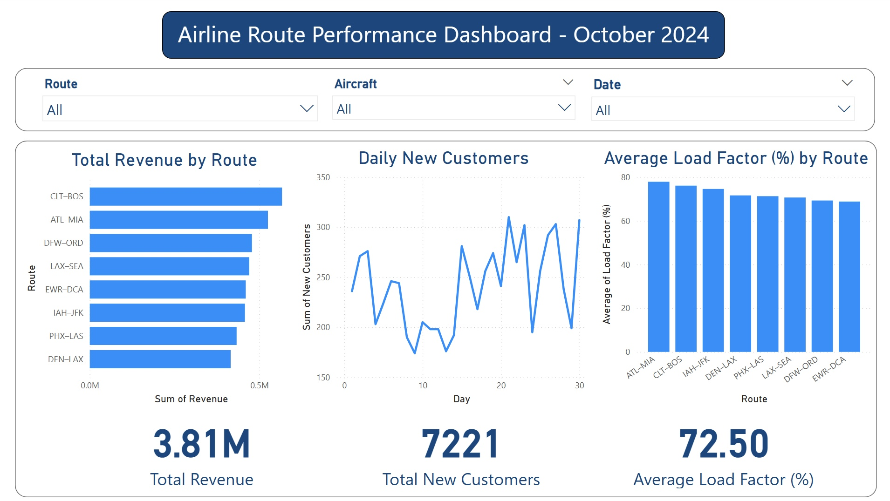

# ✈️ Airline Route Performance Analysis – Power BI Dashboard

This project analyzes domestic U.S. airline routes using simulated flight data sourced from Kaggle. The dashboard visualizes key performance metrics such as revenue, load factor, and customer acquisition across multiple city pairs, helping replicate the type of analysis performed by revenue management and network planning analysts in the aviation industry.

---

## 🎯 Project Goal

To design a dynamic and interactive Power BI dashboard that evaluates the performance of airline routes based on real-world metrics and visual storytelling. The goal was to gain deeper insight into operational efficiency and revenue drivers at the route level and explore how data can inform better airline decisions.

---

## 🔁 Workflow

1. **Data Sourcing**:  
   Dataset obtained via Kaggle and adapted to simulate 30 days of flight activity across 8 U.S. domestic routes.

2. **Data Preparation**:  
   Cleaned and structured in Excel using calculated columns and pivot tables to summarize revenue, customer volume, and load factor per route.

3. **Visualization** *(Power BI)*:
   - KPI Cards: Total Revenue, Average Load Factor, New Customers
   - Bar Charts: Route-level revenue
   - Column Charts: Load Factor performance
   - Line Charts: Customer acquisition over time
   - Slicers: Route, Aircraft, and Date for interactive filtering

---

## 🧠 Key Insights

- High-revenue routes did not always have high load factors, indicating potential overcapacity or suboptimal pricing strategies.
- Smaller aircraft (e.g., CRJ700) were more efficient on some routes, suggesting opportunities for better fleet deployment.
- Weekly spikes in new customer acquisition suggested behavioral patterns or price-sensitive demand windows.

---

## 💡 Recommendations

- **Reevaluate pricing and capacity** on underperforming high-revenue routes to improve efficiency.
- **Align aircraft selection** with route-level demand trends to boost load factors and reduce cost-per-seat.
- **Capitalize on customer behavior** by launching promotions during natural demand surges.

---

## 📈 Impact

This project helped strengthen my understanding of:
- Real-world airline KPIs like load factor, revenue per route, and customer acquisition
- Data storytelling through Power BI
- How to simulate and explore airline data for operational insights

It also confirmed my passion for aviation analytics and my interest in pursuing roles that combine commercial strategy, route planning, and revenue optimization in the airline industry.

---

## 🔧 Tools Used

- Excel (data prep, pivot summaries)
- Power BI (visualization, dashboard interactivity)
- Kaggle (base dataset)

---

## 🧑‍💻 Author

**Rehman Essani**  
[LinkedIn](https://linkedin.com/in/abdulrehmanessani) | [GitHub](https://github.com/rehmanessanidev)
